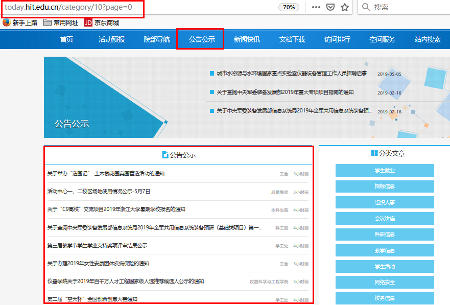
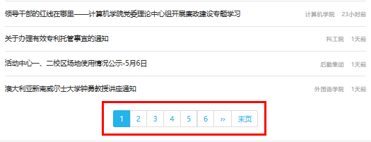
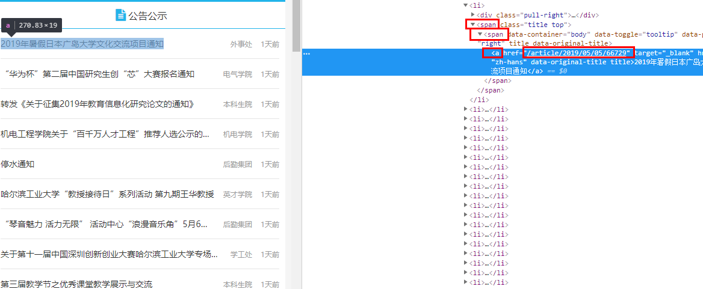
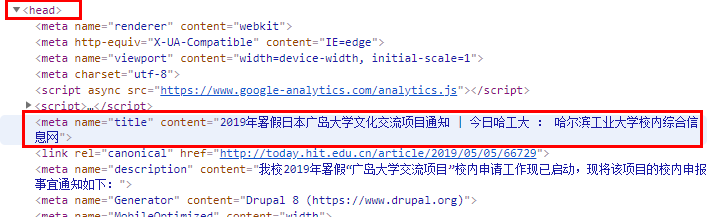
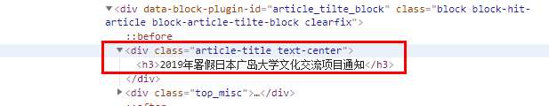
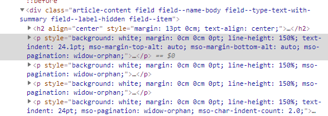
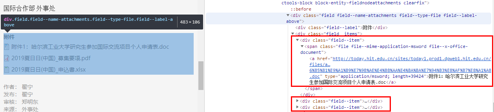
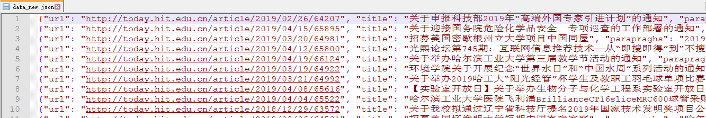
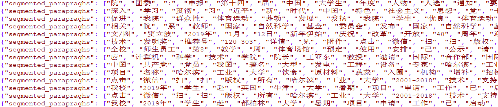

# 实验一 网页文本的预处理

## 一、实验目的
本次实验目的是对信息检索中网页文本预处理的流程和涉及的技术有一个全面的了解，包括抓去网页、网页正文提取、分词处理、停用词处理等环节。本次实验所要用到的知识如下：
- 基本编程能力（文件处理、网页爬取等）
- 分词、停用词处理

## 二、实验内容

1. 网页的抓取和正文提取
爬取至少 1000 个网页，其中包含附件的网页不少于 100 个，然后提取网页标题和网页正文，以及网页中的附件并保存附件到本地，然后将附件名称记录在 file_name 字段中。网页正文和网页标题可以自行定义，但一般应该是网页中你最关注的内容。例如在一般的新闻网页上，就以新闻标题为网页标题，新闻内容为网页正文，而其他诸如导航栏、广告等都是不关心的内容。为保证可读性，网页正文中不应该包含太多 HTML 标签（如<p>、等）。将爬取下来的数据保存为 json 格式，具体格式如下： 
```
{
"url": "http://today.hit.edu.cn/article/2019/04/23/66256", 
"title": "英国牛津大学暑期项目招生通知", 
"parapraghs": "我校2019年学生赴“英国牛津大学暑期项目”申请工作......”,
"file_name": ["项目介绍.docx", "LMH Summer Programmes Application.doc"]
}
```
2. 分词处理、去停用词处理
将提取的网页文本进行分词和去停用词处理，并将结果保存。分词工具使用pyltp。停用词表采用由社会计算与信息检索研究中心发布的停用词表 (stop_words.txt)。最后将经过分词和去停用词后的结果保存，格式如下：
```
{
"url": "http://today.hit.edu.cn/article/2019/04/23/66256",
"segmented_title": ["英国", "牛津", "大学", "暑期", "项目", "招生", "通知"],
"segmented_parapraghs": ["我校", "2019年", "学生", "赴", "英国", "牛津", "大学", "暑期", "项目", "申请", "工作", "已", "启动",......,
	"file_name": ["项目介绍.docx", "LMH Summer Programmes Application.doc"]
}
```

## 三、实验过程及结果
### 3.1 网页的抓取和正文提取
（1）网页抓取
在本次实验中我尝试抓取了网易新闻、新浪新闻、搜狗新闻主页，由于缺少文本附件，最后选取了今日哈工大的网页，下面以今日哈工大为例，根据具体的网页说明爬取的过程。  
分析网站的结构可以知道，普通新闻里很少有附件，一般都是公告公示里带有附件，所以从公告公示栏开始

而且可以通过翻页爬取更多的网页

首先查看网站源码，找到相应的新闻链接，一个页面有20条新闻链接：

爬取所有的新闻链接：这里主要用到BeautifulSoup和requests库，Beautiful Soup是一个可以从HTML或XML文件中提取结构化数据的Python库，用requests库中的get方法向网页发送请求，将获取到的内容转换成BeautifulSoup格式，并将’lxml’作为解析器。
可以使用soup.select通过直接子标签查找（’span > apan > a’）得到所有的链接，存到url集合中，这里需要注意得到的链接需要补全"http://today.hit.edu.cn"
代码实现如下：
```
wbdata = requests.get(url).text
soup = BeautifulSoup(wbdata, 'lxml')
news_titles = soup.select("span > span > a")
for n in news_titles:
    link = n.get("href")
    link = "http://today.hit.edu.cn" + link
    urlset.add(link)
```
翻页可以使用
```
driver = webdriver.Chrome('D:\Applaction\chromedriver_win32\chromedriver.exe')  # 创建一个driver用于打开网页，记得找到brew安装的chromedriver的位置，在创建driver的时候指定这个位置
driver.get(url)  # 打开网页
driver.find_element_by_xpath("//a[contains(text(),'转到下一页')]").click()  # selenium的xpath用法，找到包含“下一页”的a标签去点击
# page = page + 1
```
但这里有个简单的做法，观察网页链接
http://today.hit.edu.cn/category/10?page=1
所以每次只需要改变page=?即可
```
urls = ["http://today.hit.edu.cn/category/10?page={}".format(str(i)) for i in range(0, 70)]
```
这里为了防止爬虫爬取速度过快被封，可以设置爬取一个页面sleep 2 秒  
`time.sleep(2)  # 睡2秒让网页加载完再去读它的html代码`  
我这里做的其实比较简单，因为爬取网页的特殊性，不存在重复的url，完整的考虑应该对url进行去重。

（2）提取网页标题
网页源码中有两个地方会出现标题，一是<head>标签里
  
二是，观察源码可以发现，标签<h3>为网页的标题
  
可以指定属性查找标签，查找div标签下class为article-title-center的内容，取返回列表的第一项
```
title_ul = soup.find_all('div', {"class": "article-title text-center"})
title=title_ul[0].get_text().strip()
```
（3）提取网页正文
今日哈工大的源码非常整洁，所有正文包含在<p>标签下

可以首先选取所有的<p>标签，遍历返回的子节点列表，获取每个节点的文本
```
content = soup.select('p')
for m in range(0, len(content)):
    con = content[m].get_text().strip()
    if (len(con) != 0):
        text = text + con
    m += 1
```
（4）提取网页中的附件

附件存在于：
<span class="file file--mime-application-msword file--x-office-document">标签下，可通过查找span标签下class为file--x-office-document的内容
`file_urls = soup.find_all('span', {"class": "file--x-office-document"})`
选择a标签下的file[0].get_text()得到文件名，选择href得到文件的下载链接：
```
for item in file_urls:
    file = item.select('a')
    file_name = file[0].get_text().strip()  # 文件名
    names.append(file_name)
    fileurl = file[0].get('href')  # 文件的链接
```
文件下载：以文件名存储，每次下载128块直到下载结束
```
with open('D:/news/file_new/%s' % file_name, 'wb') as f:
    for chunk in r.iter_content(chunk_size=128):
        f.write(chunk)
```
（5）写入json文件，使用python的json库
```
data = {
    "url": url,
    "title": title[0].get_text().strip(),
    "parapraghs": text,
    "file_name": names
}
json_str = json.dumps(data, ensure_ascii=False)
ff.write(json_str+'\n')
```
（6）实验结果
共爬取了2000条数据，其中附件文档338个。


### 3.2 分词处理、去停用词处理
（1）pyltp安装
Pyltp还不适用python3.7，换了python3.5之后下载了
pyltp-0.2.1-cp35-cp35m-win_amd64.whl
通过cmd命令进入whl所在目录，pip install wheel文件名 安装
下载相应的分词模型，设置模型的路径
```
LTP_DATA_DIR = 'D:/ltp_data_v3.4.0'  # ltp模型目录的路径
cws_model_path = os.path.join(LTP_DATA_DIR, 'cws.model')  # 分词模型路径，模型名称为`cws.model`
```
（2）分词
注意words = segmentor.segment('sentence') 的返回值类型是native的VectorOfString类型
```
def seg_part(sentence):
    segmentor = Segmentor()  # 初始化实例
    segmentor.load(cws_model_path)  # 加载模型
    words = segmentor.segment(sentence)  # 分词
    # print('\t'.join(words))
    segmentor.release()  # 释放模型
    return '\t'.join(words)
```
（3）去停用词
根据实验提供的停用词表，将停用词存到list中，由于标题和正文中可能还存在一些特殊字符，如：
```
add_punc = ['【', ' 】', '（', '）', '‘', '’', '{', '}', '⑦', '(', ')', '%', '^', '<', '>', '℃', '.', '-', '——', '=', '&',
            '#', '@', '￥', '$']  # 定义要删除的特殊字符
```
添加到stopwords列表中，便于分词时删除
```
def stopwordslist():
    stopwords = [line.strip() for line in open('stopwords(new).txt', encoding='UTF-8').readlines()]
    stopwords = stopwords + add_punc
    return stopwords
```
判断切分之后的词语是否存在于stopwords列表中，如果存在则不写入文件
```
title = seg_part(result['title'])
titlelist = []
for item in title.split('\t'):
    if item not in stopwords:
        if item != '\t':
            titlelist.append(item)
```
将标题和正文分词后写入json文件
```
data = {
    "url": result['url'],
    "segmented_title": titlelist,
    "segmented_parapraghs": textlist,
    "file_name": result['file_name']
}
json_str = json.dumps(data, ensure_ascii=False)
fin.write(json_str + '\n')
```
（4）实验结果


## 四、实验心得
&emsp;首先反思这次实验我做的很简单，有点投机取巧的感觉（今日哈工大源码友好），虽然达到了实验要求，但是确实有很大的改进空间，比如可以使用多线程爬取，当时考虑的是因为主要爬取的是今日哈工大，怕爬取速度过快被封，本身还要sleep几秒，就觉得没必要再用多线程，但从实验的创新性上讲确实做得不全面，下次实验一定注意。  
&emsp;其次在爬取网页时加深了对网页结构的了解，理解了爬虫程序的运作过程，在分词方面，我对比了自己写的分词程序与ltp分词后的效果，效果方面自愧不如，有时间一定要读一下分词模型的训练过程，不过我也发现了分词的一些缺陷，比如涉及到人名，分词会不准确，如："贯彻", "落", "实习", "近平", "总书记"，可能ltp需要补充一下分词词典了。
